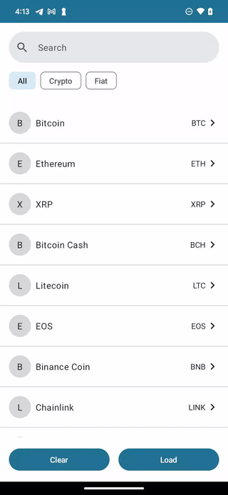

# crypto-dot-com

The APK can be downloaded from here: [Demo APP APK](screenshot/app-debug.apk).

## Main Features:

1. **Clear Button**: Clicking this button will clear the data in the local database.
2. **Load Button**: Clicking this button will reload the JSON files and insert them into the database.
3. **Search Bar**: Provides search functionality at the top.
4. **Filters**: Below the search bar, there are three filters: All, Crypto, Fiat.
5. **No Use Case**: We didn't introduce Use Cases for this app since the requirements were relatively simple.
6. **Unit Tests**: CurrencyListViewModel + CurrencyFilter
